<div align="center">

# Signal Object Detection

### From-scratch deep learning for noisy signal-image counting

A custom computer-vision pipeline for classifying spectrogram-like images into **five ordered classes**, where each class represents the number of visible signal objects.

**Residual CNN · Squeeze-and-Excitation · Multi-task Learning · 5-Fold CV · Pseudo-Labeling · TTA · OOF Blending**

**Final result: 5th place out of 130 participants · Leaderboard score: `0.80436`**

</div>

---

## Overview

This project tackles a five-class image classification problem with an important twist: the target classes represent **signal counts**.

That makes the task more structured than ordinary categorical classification.

```text
Class 1 < Class 2 < Class 3 < Class 4 < Class 5
```

The final solution was built entirely **from scratch**, without pretrained backbones or external data, and evolved from a simple KNN baseline into a multi-stage convolutional ensemble.

### Final pipeline

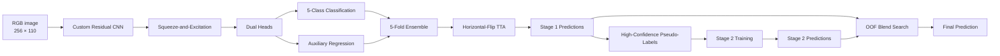

---

## Key Results

| Component | Final setup |
|---|---|
| Task | 5-class signal-count classification |
| Dataset | ~15.5k labeled images |
| Input | RGB, `256 × 110` |
| Model | Custom residual CNN |
| Attention | Squeeze-and-Excitation |
| Learning objective | Classification + auxiliary regression |
| Validation | 5-fold Stratified K-Fold |
| Semi-supervised learning | Pseudo-labeling at `0.90` confidence |
| Inference | Fold ensemble + horizontal-flip TTA |
| Final ensemble | OOF-optimized Stage 1 / Stage 2 blend |
| Pretrained weights | None |
| External data | None |
| Best leaderboard score | **`0.80436`** |

---

## Problem

The dataset contains noisy, spectrogram-like signal images.

Each image belongs to one of five classes corresponding to the number of visible signal structures.

### Representative samples

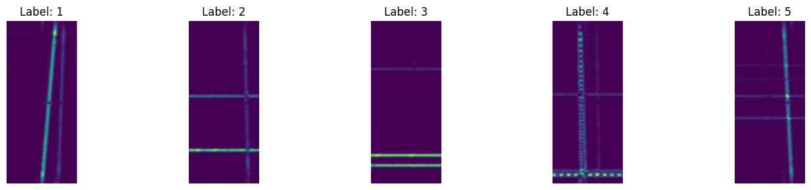

Several properties make the problem challenging:

- signal intensity varies significantly;
- signals may be horizontal, vertical, or mixed;
- spatial position changes between samples;
- multiple signals can partially overlap;
- neighboring classes may look visually similar;
- noise can obscure weak structures.

The most important consequence is that **spatial information matters**.

Flattening an image into a feature vector removes much of the structure needed to distinguish different signal counts, which is exactly why the KNN baseline quickly reached its limits.

---

## Model Evolution

The project was developed incrementally.

```text
KNN baseline
    ↓
Custom CNN
    ↓
Residual learning
    ↓
Squeeze-and-Excitation
    ↓
Dual classification + regression heads
    ↓
5-fold cross-validation
    ↓
Test-Time Augmentation
    ↓
Pseudo-labeling
    ↓
Second-stage training
    ↓
OOF-optimized probability blending
```

Each step addressed a concrete weakness in the previous version rather than simply increasing model complexity.

---

# 1. KNN Baseline

KNN was used primarily to validate the data pipeline and establish a simple reference point.

### Preprocessing

```text
Image
  ↓
Grayscale
  ↓
Resize to 64 × 64
  ↓
Normalize to [0, 1]
  ↓
Flatten
  ↓
4096-dimensional feature vector
```

The following variants were evaluated:

- `euclidean` and `cosine` distance;
- `uniform` and `distance` weighting;
- multiple values of `k`.

```python
K_VALUES = [1, 3, 5, 7, 9, 11, 15, 21, 31, 41, 61, 81, 101]
```

### Why KNN was limited

The main issue is not simply model capacity.

After flattening, two nearby pixels are treated no differently from two pixels at opposite ends of the image. The classifier sees only distances between high-dimensional vectors and cannot naturally exploit local image structure.

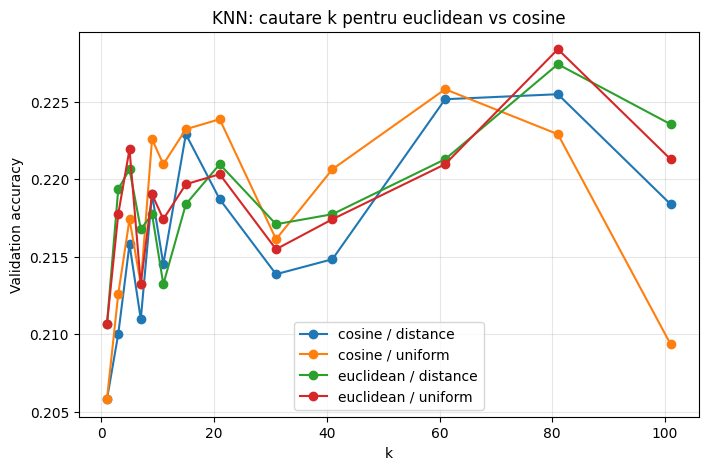

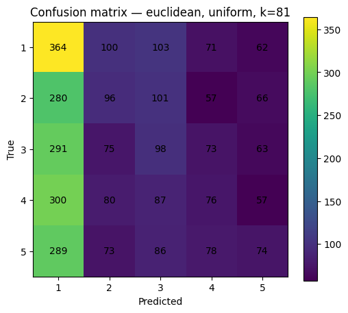

This motivated the move to a convolutional model.

---

# 2. SignalCNN

The final architecture is a custom CNN trained from scratch.

Its design focuses on three requirements:

1. preserve local spatial structure;
2. learn progressively higher-level signal features;
3. exploit the ordered nature of the labels.

---

## Architecture

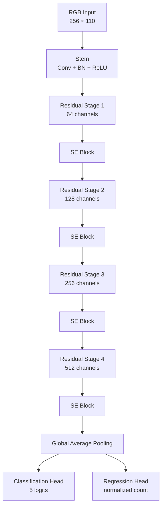

### Backbone

| Stage | Channels | Role |
|---|---:|---|
| Stem | 32 | Low-level feature extraction |
| Stage 1 | 64 | Early spatial patterns |
| Stage 2 | 128 | Increased feature capacity |
| Stage 3 | 256 | Higher-level signal morphology |
| Stage 4 | 512 | Final latent representation |

---

## Residual Learning

Residual blocks introduce shortcut connections:

```text
        ┌────────────────────────────┐
        │                            │
x ──────┴───────────────┐            │
                        ▼            │
      Conv → BN → ReLU → Conv → BN   │
                        │            │
                        └──── + ─────┘
                              ↓
                            ReLU
```

This improves optimization by allowing information and gradients to propagate more directly through the network.

It also made it possible to deepen the model without making training unstable.

---

## Squeeze-and-Excitation

After residual feature extraction, Squeeze-and-Excitation modules perform **channel-wise feature recalibration**.

```text
Feature Maps
    ↓
Global Pooling
    ↓
Channel Importance
    ↓
Reweight Features
```

Instead of treating every channel equally, the model learns which channels are most informative for each input.

For this problem, that is useful because different channels may react to different signal orientations, intensities, or structural patterns.

---

# 3. Multi-Task Learning

The final model does not learn from classification alone.

It uses two output heads sharing the same representation.

```text
                Shared CNN Features
                    /         \
                   /           \
      Classification Head    Regression Head
             ↓                     ↓
         5 classes          normalized count
```

## Classification objective

The main head predicts the five target classes using Cross-Entropy loss.

## Auxiliary regression objective

The second head predicts a continuous normalized value related to the signal count.

It does **not** determine the final class directly.

Instead, it injects the ordinal structure of the problem into training.

For example:

```text
Class 2 is closer to Class 3 than to Class 5
```

Standard Cross-Entropy does not encode this relationship explicitly, while the auxiliary regression task does.

### Combined loss

```math
\mathcal{L}
=
(1-\alpha)\mathcal{L}_{CE}
+
\alpha\mathcal{L}_{\mathrm{SmoothL1}}
```

with:

```python
ALPHA = 0.50
```

The final objective combines:

- `CrossEntropyLoss` for classification;
- `SmoothL1Loss` for regression.

---

# 4. Preprocessing

CNN inputs remain in RGB format.

```python
IMAGE_HEIGHT = 256
IMAGE_WIDTH = 110
```

Training-set statistics are used for normalization.

```python
mean = [0.266, 0.050, 0.360]
std  = [0.022, 0.111, 0.053]
```

### Validation / test pipeline

```text
Resize
  ↓
Tensor conversion
  ↓
Normalization
```

No random augmentation is applied during validation or standard test preprocessing.

---

# 5. Data Augmentation

Augmentations are applied online during training.

A deliberately conservative policy is used: **at most one augmentation is applied to each image**.

This increases variation without destroying the semantic structure of the signal.

| Augmentation | Probability | Purpose |
|---|---:|---|
| Mosaic4 | `0.10` | Combine four compatible samples |
| Mosaic2 | `0.12` | Combine two compatible samples |
| SpecAugment | `0.20` | Robustness to masked/noisy regions |
| Horizontal Flip | `0.18` | Horizontal invariance |
| Affine | `0.20` | Small translations and scaling |

---

## Mosaic

Mosaic is particularly suitable for this task because the labels encode counts.

If two compatible images are combined, their labels can be combined as well:

```text
Class 1 + Class 2 → Class 3
```

provided that the resulting label remains inside the valid `1–5` range.

This allows the augmentation to alter both the image and target in a semantically meaningful way.

---

## SpecAugment

The images resemble spectrogram-like representations.

Masking horizontal or vertical bands forces the network to avoid depending on one highly specific region and encourages learning from a broader spatial context.

```text
Original signal image
        ↓
Mask frequency/time-like regions
        ↓
Model must infer from remaining structure
```

---

## Conservative affine augmentation

Only small transformations are used.

Aggressive rotations or geometric distortions could change the meaning of the underlying signal rather than generate a valid variation of the same sample.

---

# 6. Training

The final configuration was:

```python
NUM_CLASSES = 5

IMAGE_HEIGHT = 256
IMAGE_WIDTH = 110

BATCH_SIZE = 16
N_SPLITS = 5
SEED = 42

ALPHA = 0.50

EPOCHS_STAGE1 = 90
EPOCHS_STAGE2 = 90
EARLY_STOP_PATIENCE = 35

LEARNING_RATE = 1e-4
WEIGHT_DECAY = 5e-4
LABEL_SMOOTHING = 0.02

PSEUDO_LABEL_THRESHOLD = 0.90
USE_TTA_HFLIP = True
```

### Optimizer

```text
AdamW
```

### Regularization

- weight decay: `5e-4`;
- label smoothing: `0.02`;
- online augmentation;
- early stopping;
- cross-validation;
- model ensembling.

Label smoothing is especially useful because the pipeline later relies on model confidence for pseudo-label selection.

---

# 7. Stratified 5-Fold Cross-Validation

Rather than relying on one train/validation split, the pipeline uses:

```text
5-fold Stratified K-Fold
```

For each fold:

```text
80% → training
20% → validation
```

with class proportions preserved as closely as possible.

### Why this matters

Every training example receives a prediction from a model that did **not** train on that example.

These are the **out-of-fold predictions**.

```text
Fold 1 validation ─┐
Fold 2 validation ─┤
Fold 3 validation ─┼─→ Complete OOF prediction set
Fold 4 validation ─┤
Fold 5 validation ─┘
```

OOF predictions provide a much stronger basis for evaluating and combining models than predictions from a single split.

At inference time, the five fold models form an ensemble:

```math
p(x)
=
\frac{1}{5}
\sum_{k=1}^{5}
p_k(x)
```

---

# 8. Early Stopping

Each fold stores the checkpoint with the best validation accuracy.

Training terminates if validation performance does not improve for:

```python
EARLY_STOP_PATIENCE = 35
```

epochs.

This limits unnecessary training and reduces fold-specific overfitting.

---

# 9. Test-Time Augmentation

Inference uses horizontal-flip TTA.

Each test image is evaluated twice:

```text
                 ┌→ Original → Model ─────────┐
Input image ─────┤                            ├→ Average probabilities
                 └→ H-Flip  → Model ─────────┘
```

This provides a lightweight ensemble over two equivalent spatial views.

---

# 10. Pseudo-Labeling

The strongest pipeline adds a second training stage using high-confidence predictions from Stage 1.

## Stage 1

Train the five-fold ensemble using only ground-truth data.

```text
Ground-truth training data
        ↓
5-fold training
        ↓
Stage 1 models
        ↓
Test probabilities
```

## Pseudo-label selection

A test sample becomes a pseudo-labeled training example only when:

```python
max_probability >= 0.90
```

Low-confidence predictions are discarded.

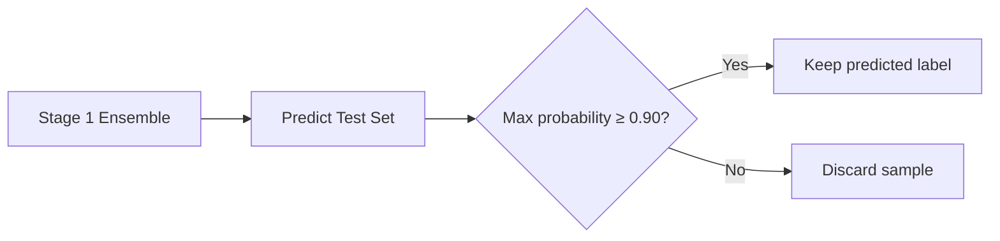

## Stage 2

Stage 2 is trained using:

```text
Ground-truth data
+
High-confidence pseudo-labeled data
```

One important safeguard is maintained:

> **Validation contains only original ground-truth examples.**

Pseudo-labels are added only to the training side of each fold.

This prevents artificial inflation of validation accuracy.

---

# 11. Stage Blending

Pseudo-labeling improves the model, but Stage 1 and Stage 2 do not make identical mistakes.

Instead of selecting only one stage, the final system blends their probability outputs:

```math
p_{\mathrm{final}}
=
(1-w)p_{\mathrm{stage1}}
+
w p_{\mathrm{stage2}}
```

The weight `w` is selected using **OOF predictions**.

This is important because the blend is optimized without using hidden test labels.

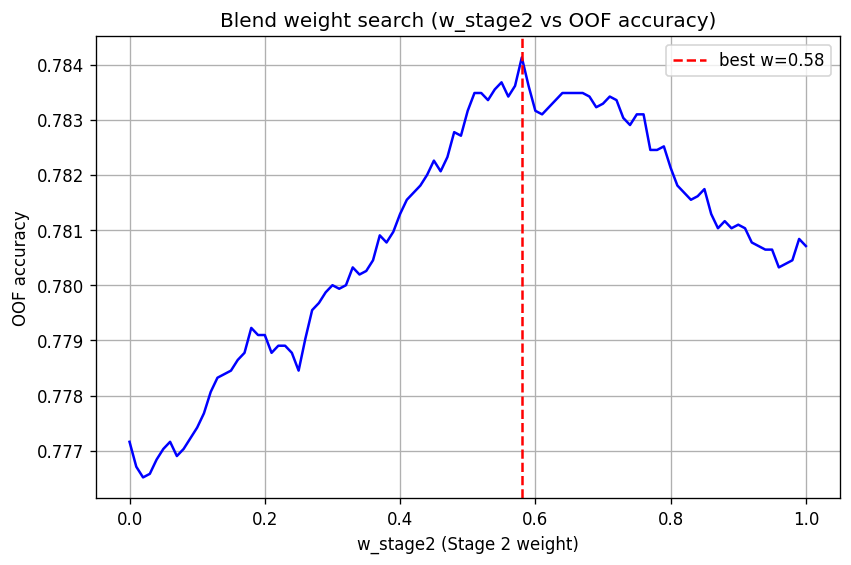

The final blend benefits from complementary error patterns between both stages.

---

# Results

## Stage 1

### Accuracy

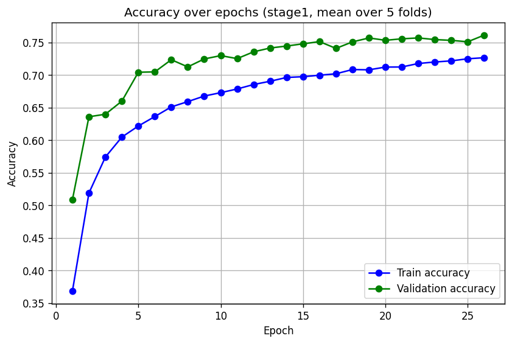

### Loss

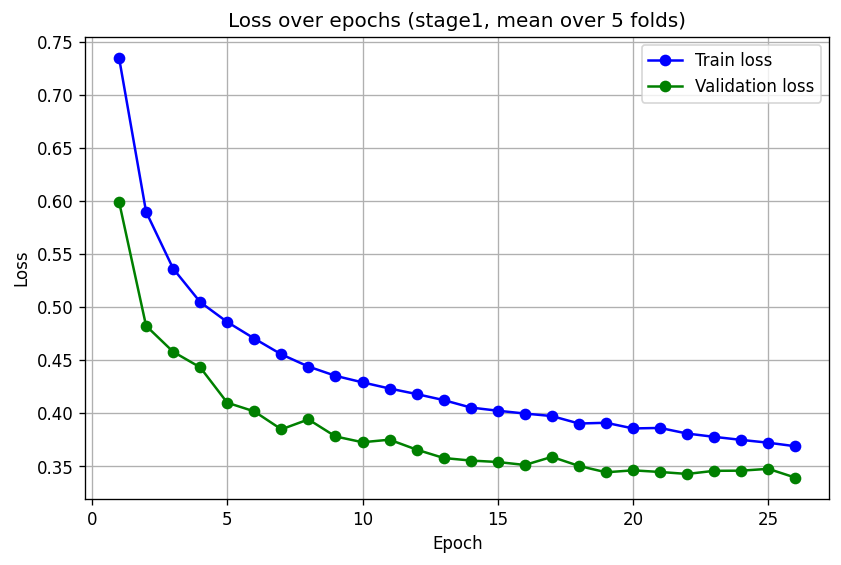

### Confusion matrix

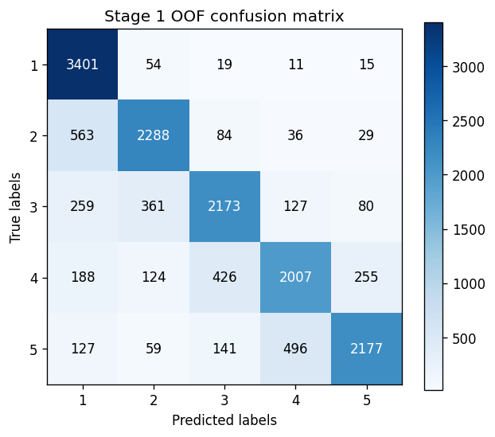

A recurring Stage 1 error pattern is confusion between neighboring classes, particularly a tendency to underestimate the signal count.

---

## Stage 2

### Accuracy

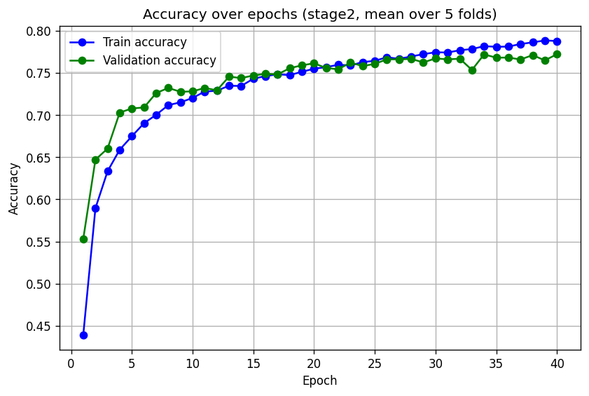

### Loss

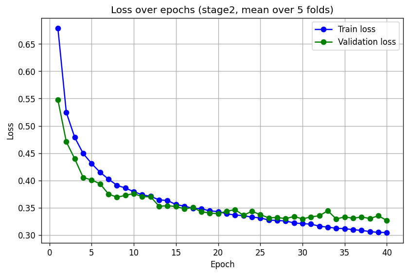

### Confusion matrix

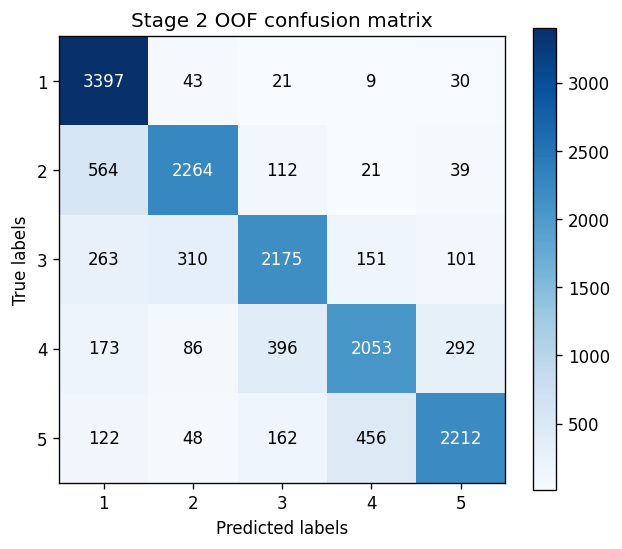

Pseudo-labeling improves the behavior of the higher-count classes, especially classes `4` and `5`, while introducing a slight trade-off for some lower classes.

---

## Final Blend

### OOF confusion matrix

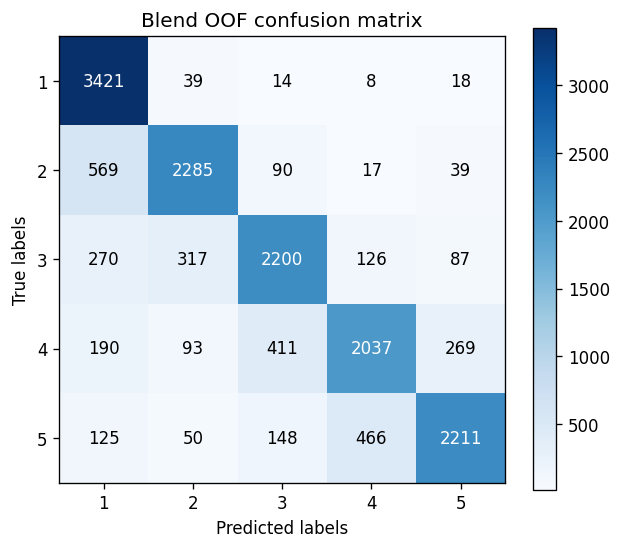

### Per-class accuracy

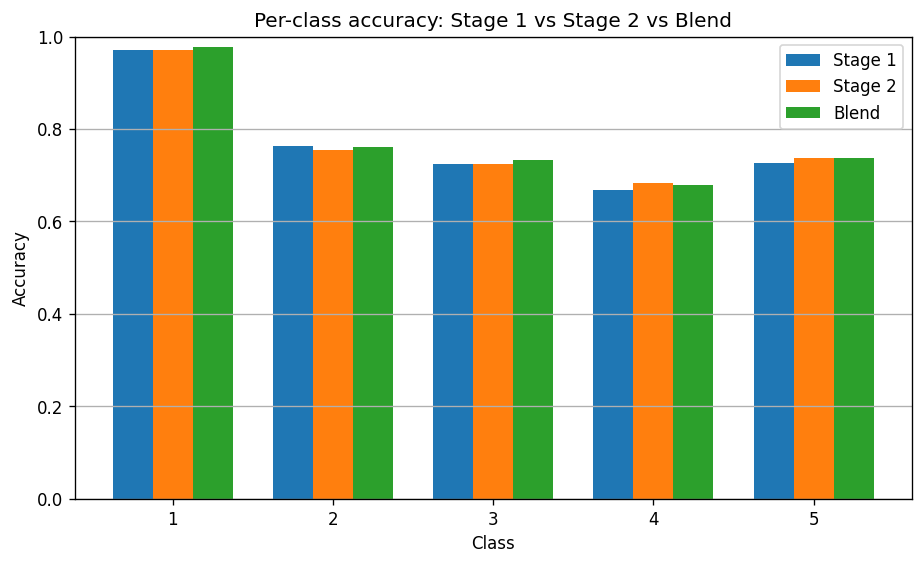

The blended model provides the strongest per-class accuracy among the main evaluated variants.

---

## Test Prediction Distribution

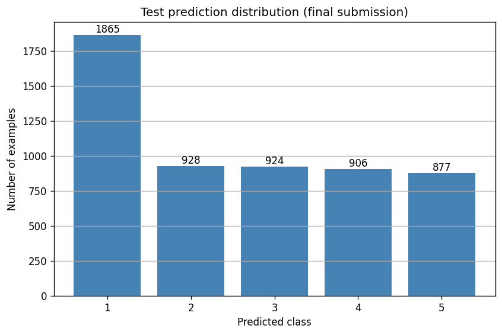

The final model shows a noticeable preference for class `1`, which appears almost twice as often as any other individual predicted class.

---

# Final Model

The strongest documented configuration is:

```text
RGB input: 256 × 110
        ↓
Custom convolutional stem
        ↓
Residual blocks
        ↓
Squeeze-and-Excitation
        ↓
Global Average Pooling
        ↓
Classification head + auxiliary regression head
        ↓
CrossEntropy + SmoothL1
        ↓
5-fold Stratified K-Fold
        ↓
Horizontal-flip TTA
        ↓
Stage 1 ensemble
        ↓
Confidence-based pseudo-labeling
        ↓
Stage 2 ensemble
        ↓
OOF-optimized Stage 1 / Stage 2 blend
        ↓
Final prediction
```

### Best leaderboard score

```text
0.80436
```

---

# What Made the Biggest Difference

## 1. Moving away from flattened features

The KNN baseline confirmed that raw pixel distances were not enough.

The strongest gain came from introducing a model capable of learning local spatial patterns.

## 2. Residual feature extraction

Residual blocks made deeper feature learning practical while maintaining stable optimization.

## 3. Channel attention

Squeeze-and-Excitation allowed the network to selectively emphasize useful feature channels.

## 4. Exploiting label ordering

The auxiliary regression objective provided supervision that Cross-Entropy alone cannot express.

## 5. Cross-validation as part of the model

K-Fold was not used only for evaluation.

The five trained models also became the final inference ensemble.

## 6. Conservative pseudo-labeling

Only highly confident samples were reused, reducing the risk of reinforcing incorrect predictions.

## 7. OOF-based ensemble optimization

The final Stage 1 / Stage 2 blend was selected using out-of-fold predictions rather than arbitrary weights.

---

# Lessons Learned

A few general conclusions emerged from the experiments:

- **Spatial structure matters more than raw pixel similarity.**
- **Simple baselines are extremely useful for validating the pipeline.**
- **Multi-task supervision can encode structure that ordinary classification loss ignores.**
- **Cross-validation can improve both evaluation quality and final inference performance.**
- **Pseudo-labeling works best when confidence filtering is strict.**
- **Validation must remain isolated from pseudo-labeled data.**
- **Probability blending can outperform choosing a single model or training stage.**
- **Strong results do not necessarily require pretrained models when the architecture matches the problem well.**

---

# References

- K. He, X. Zhang, S. Ren, J. Sun,  
  **Deep Residual Learning for Image Recognition**, CVPR 2016  
  https://arxiv.org/abs/1512.03385

- J. Hu, L. Shen, S. Albanie, G. Sun, E. Wu,  
  **Squeeze-and-Excitation Networks**, CVPR 2018  
  https://arxiv.org/abs/1709.01507

- D. S. Park, W. Chan, Y. Zhang, C.-C. Chiu, B. Zoph, E. D. Cubuk, Q. V. Le,  
  **SpecAugment: A Simple Data Augmentation Method for Automatic Speech Recognition**, Interspeech 2019  
  https://arxiv.org/abs/1904.08779

- PyTorch Documentation  
  https://pytorch.org/docs/stable/

---

<div align="center">

### Built from scratch — from KNN baseline to a multi-stage CNN ensemble.

</div>
